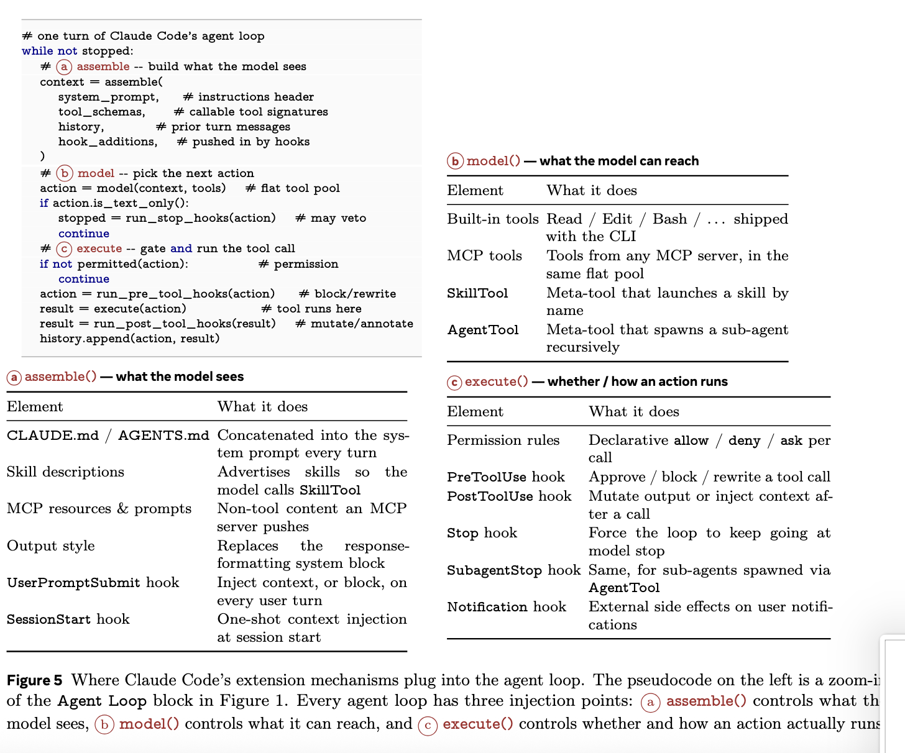

# 深入理解 Claude Code

<p align="center">
  
</p>

<p align="center">
  <a href="./paper/Dive_into_Claude_Code.pdf"></a>
  <a href="https://arxiv.org/abs/2604.14228"></a>
  <a href="./LICENSE"></a>
  <a href="https://github.com/VILA-Lab/Dive-into-Claude-Code/stargazers"></a>
</p>

> **一份面向 Claude Code（v2.1.88，约 1,900 个 TypeScript 文件、约 512K 行代码）的全面源码级架构分析，附带社区分析精选、面向智能体开发者的设计空间指南，以及跨系统对比。**

> [!TIP]
> **TL;DR** —— Claude Code 代码库里只有 1.6% 是 AI 决策逻辑；其余 98.4% 都是确定性基础设施——权限门控、上下文管理、工具路由和恢复逻辑。智能体循环本身是一个简单的 while 循环；真正的工程复杂度集中在它周围的各类系统上。本仓库剖析这一架构，并为所有构建 AI 智能体系统的人提炼出可落地的设计指南。

---

## 目录

**来自我们的论文**

- [🌟 关键亮点](#关键亮点)
- [📖 阅读指南](#阅读指南)
- [🏗️ 架构总览](#架构总览)
- [🧭 价值观与设计原则](#价值观与设计原则)
- [🔄 智能体查询循环](#智能体查询循环)
- [🛡️ 安全与权限](#安全与权限)
- [🧩 可扩展性](#可扩展性)
- [🧠 上下文与记忆](#上下文与记忆)
- [👥 子智能体委托](#子智能体委托)
- [💾 会话持久化](#会话持久化)

**论文之外**

- [🛠️ 构建你自己的 AI 智能体：设计指南](#构建你自己的-ai-智能体设计指南)
- [🌐 社区项目与研究](#社区项目与研究)
- [🚀 其他值得关注的 AI 智能体项目](#其他值得关注的-ai-智能体项目)
- [🔖 引用](#引用)

---

## 关键亮点

- **98.4% 基础设施，1.6% AI** —— 智能体循环不过是一个 while 循环；真正的工程复杂度集中在权限门控、上下文管理和恢复逻辑上。
- **5 个价值观 → 13 条原则 → 实现** —— 每一条设计决策都能追溯回人类决策权威、安全、可靠性、能力和适应性。
- **深度防御却存在共享故障模式** —— 7 层安全防护，但都共享性能约束；子命令超过 50 个的命令会绕过安全分析。
- **4 个 CVE 暴露了预信任窗口** —— 扩展会在信任对话框出现**之前**就已执行。
- **横跨各层的 harness 难以被重新实现** —— 循环本身容易复制，但钩子、分类器、压缩和隔离机制则不然。

---

## 阅读指南

| 如果你是…… | 从这里开始 | 然后阅读 |
|:----------------|:-----------|:----------|
| **智能体构建者** | [构建你自己的智能体](./docs/build-your-own-agent_zh.md) | [架构深度剖析](./docs/architecture_zh.md) |
| **安全研究员** | [安全与权限](#安全与权限) | [架构：安全层](./docs/architecture_zh.md#七个独立安全层) |
| **产品经理** | [关键亮点](#关键亮点) | [价值观与原则](#价值观与设计原则) |
| **研究人员** | [完整论文 (arXiv)](https://arxiv.org/abs/2604.14228) | [社区资源](#社区项目与研究) |

`1,884 个文件` · `约 512K 行` · `v2.1.88` · `7 个安全层` · `5 个压缩阶段` · `54 个工具` · `27 个钩子事件` · `4 个扩展机制` · `7 个权限模式`

---

<details open>
<summary><h2>架构总览</h2></summary>

Claude Code 回答了每个生产级编码智能体都必须面对的**四个设计问题**：

| 问题 | Claude Code 的答案 |
|:---------|:---------------------|
| 推理放在哪里？ | 模型负责推理，harness 负责强制执行。约 1.6% 是 AI，98.4% 是基础设施。 |
| 有多少个执行引擎？ | 一个 `queryLoop` 供所有入口（CLI、SDK、IDE）共用。 |
| 默认的安全姿态是什么？ | 拒绝优先：拒绝 > 询问 > 允许；最严格的规则优先。 |
| 最根本的资源约束是什么？ | 约 200K（旧模型）/ 1M（Claude 4.6 系列）的上下文窗口。每次模型调用前都要过 5 层压缩。 |

系统分解为**7 个组件**（用户 → 入口 → 智能体循环 → 权限系统 → 工具 → 状态与持久化 → 执行环境），跨越**5 个架构层**。

<p align="center">
  
</p>

> [!NOTE]
> 完整的架构深度剖析——7 个安全层、9 步轮次管道、5 层压缩等——请参阅**[docs/architecture_zh.md](./docs/architecture_zh.md)**。

<p align="right"><a href="#深入理解-claude-code">↑ 返回顶部</a></p>

</details>

---

<details open>
<summary><h2>价值观与设计原则</h2></summary>

架构从**5 个人类价值观**追溯到**13 条设计原则**再到实现：

| 价值观 | 核心思想 |
|:------|:----------|
| **人类决策权威** | 人类通过主体层级保持控制。当 93% 的提示批准率暴露出批准疲劳后，Anthropic 的应对是重新划分边界，而不是追加更多警告。 |
| **安全、安保、隐私** | 即使在人类警惕性下降时，系统也能守住安全底线。7 个独立安全层。 |
| **可靠执行** | 按用户的本意去执行；收集—行动—验证的闭环；优雅恢复。 |
| **能力放大** | "一个 Unix 工具，而不是产品。"98.4% 是让模型能够工作的确定性基础设施。 |
| **上下文适应性** | CLAUDE.md 层级、渐进式的可扩展性，以及随时间演变的信任轨迹。 |

<details>
<summary><b>13 条设计原则</b></summary>

| 原则 | 设计问题 |
|:----------|:----------------|
| 拒绝优先并交由人工升级 | 遇到未知操作，是允许、阻止还是交由人工升级？ |
| 渐进式信任光谱 | 用固定权限等级，还是让用户随使用深入逐步跨越的信任光谱？ |
| 深度防御 | 一道安全边界，还是多道相互重叠的安全边界？ |
| 外部化的可编程策略 | 硬编码策略，还是带生命周期钩子的外部化配置？ |
| 上下文是稀缺资源 | 一次性截断，还是渐进式流水线？ |
| 仅追加的持久状态 | 可变状态、快照，还是仅追加的日志？ |
| 最小脚手架，最大 harness | 把投入放在脚手架上，还是放在运行基础设施上？ |
| 价值观优先于规则 | 刚性流程，还是带确定性护栏的语境化判断？ |
| 可组合的多机制扩展 | 单一 API，还是开销各异的分层机制？ |
| 按可逆性加权的风险评估 | 对所有操作一视同仁，还是对可逆操作放宽监管？ |
| 透明、基于文件的配置与记忆 | 用不透明的数据库和嵌入向量，还是用户可直接查看的文件？ |
| 隔离的子智能体边界 | 共享上下文与权限，还是相互隔离？ |
| 优雅恢复与韧性 | 硬失败，还是静默恢复？ |

</details>

论文还引入了**第六个评估视角**——长期能力保持——并援引证据表明：在 AI 辅助条件下工作的开发者，在理解力测试中得分低 17%。

<p align="right"><a href="#深入理解-claude-code">↑ 返回顶部</a></p>

</details>

---

<details>
<summary><h2>智能体查询循环</h2></summary>

<p align="center">
  
</p>

核心是一个 **ReAct 模式的 while 循环**：组装上下文 → 调用模型 → 分派工具 → 检查权限 → 执行 → 重复。实现为一个产生流式事件的 `AsyncGenerator`。

**每次模型调用前**，五个压缩整形阶段按顺序执行（开销最低者优先）：预算削减 → 裁剪 → 微压缩 → 上下文折叠 → 自动压缩。

**每轮 9 步管道：** 设置解析 → 状态初始化 → 上下文组装 → 5 个预模型整形阶段 → 模型调用 → 工具分派 → 权限门控 → 工具执行 → 停止条件

**两条执行路径：**
- `StreamingToolExecutor` —— 工具流入时即开始执行（延迟优化）
- 后备 `runTools` —— 将工具分类为并发安全或互斥

**故障恢复：** 最大输出 token 升级（3 次重试）、反应式压缩（每轮一次）、提示过长处理、流式后备、后备模型

**5 个停止条件：** 无工具调用、最大轮次、上下文溢出、钩子干预、显式中止

<p align="right"><a href="#深入理解-claude-code">↑ 返回顶部</a></p>

</details>

---

<details open>
<summary><h2>安全与权限</h2></summary>

<p align="center">
  
</p>

**7 个权限模式**构成渐进式信任光谱：`plan` → `default` → `acceptEdits` → `auto`（ML 分类器）→ `dontAsk` → `bypassPermissions`（+ 内部 `bubble`）。

**拒绝优先**：宽范围的拒绝规则*始终*压过窄范围的允许规则。**7 个独立安全层**，从工具预过滤，到 shell 沙箱，再到钩子拦截。**恢复会话时权限永不自动恢复**——每次会话都要重新建立信任。

> [!WARNING]
> **共享故障模式：** 当各层共享同一种约束时，深度防御就会退化。逐个子命令解析会让事件循环陷入饥饿——一旦子命令超过 50 个，Claude Code 就会为了避免 REPL 卡死而跳过整段安全分析。

<details>
<summary><b>更多详情：授权管道、auto 模式分类器、CVE</b></summary>

**授权管道：** 预过滤（剥离被拒绝的工具）→ PreToolUse 钩子 → 拒绝优先规则评估 → 权限处理程序（4 个分支：协调器、swarm worker、推测式分类器、交互式）

**Auto 模式分类器**（`yoloClassifier.ts`）：使用内部/外部权限模板的单独 LLM 调用。两阶段：快速过滤 + 思维链。

**预信任窗口：** 两个已修复的 CVE 根因相同——钩子和 MCP 服务器会在初始化阶段、信任对话框弹出*之前*就已执行，由此形成一个绕开拒绝优先管道、天然享有特权的攻击窗口。

</details>

<p align="right"><a href="#深入理解-claude-code">↑ 返回顶部</a></p>

</details>

---

<details>
<summary><h2>可扩展性</h2></summary>

<p align="center">
  
</p>

**四个渐进式上下文成本机制：** 钩子（零成本）→ Skills（低成本）→ 插件（中成本）→ MCP（高成本）。智能体循环中的三个注入点：**assemble()**（模型看到的内容）、**model()**（它能触及的内容）、**execute()**（操作是否/如何运行）。

**工具池组装**（5 步）：基础枚举（最多 54 个工具）→ 模式过滤 → 拒绝预过滤 → MCP 集成 → 去重

**27 个钩子事件**，跨越 5 个类别，4 种执行类型（shell、LLM 评估、webhook、subagent 验证器）

**插件清单**支持 10 种组件类型：命令、智能体、skills、钩子、MCP 服务器、LSP 服务器、输出样式、通道、设置、用户配置

**Skills：** SKILL.md 含 15+ 个 YAML frontmatter 字段。关键区别——SkillTool 把内容注入到当前上下文；AgentTool 另开一个隔离的上下文。

<p align="right"><a href="#深入理解-claude-code">↑ 返回顶部</a></p>

</details>

---

<details open>
<summary><h2>上下文与记忆</h2></summary>

<p align="center">
  
</p>

由 **9 个有序来源**拼装出上下文窗口。CLAUDE.md 指令作为**用户上下文**传递（模型对其遵从是概率性的），而非系统提示（遵从是确定性的）。记忆是**基于文件的**（不使用向量数据库）——完全可查看、可编辑、可纳入版本控制。

**4 级 CLAUDE.md 层级：** 托管（`/etc/`）→ 用户（`~/.claude/`）→ 项目（`CLAUDE.md`、`.claude/rules/`）→ 本地（`CLAUDE.local.md`，被 gitignore 忽略）

**5 层压缩**（渐进式惰性降级）：预算削减 → 裁剪 → 微压缩 → 上下文折叠（读取时投影，非破坏性）→ 自动压缩（完整模型摘要，最后手段）

**记忆检索：** 由 LLM 扫描各记忆文件的文件头，最多挑出 5 个相关文件。不使用嵌入向量，也不使用向量相似度。

<p align="right"><a href="#深入理解-claude-code">↑ 返回顶部</a></p>

</details>

---

<details>
<summary><h2>子智能体委托</h2></summary>

<p align="center">
  
</p>

**6 个内置类型**（Explore、Plan、General-purpose、Guide、Verification、Statusline）+ 通过 `.claude/agents/*.md` 定义的自定义智能体。**侧链转录稿**：只把摘要回传给父级（父级上下文*被屏蔽*在子智能体的冗长输出之外）。三种隔离模式：worktree、remote、in-process。多实例间通过 POSIX `flock()` 协调。

**SkillTool vs AgentTool：** SkillTool 把内容注入到当前上下文（开销低）。AgentTool 另开一个隔离的上下文（开销高，但能防止上下文爆炸）。

**权限覆盖：** 子智能体 `permissionMode` 生效，除非父级处于 `bypassPermissions`/`acceptEdits`/`auto`（显式用户决策始终优先）。

**自定义智能体：** YAML frontmatter 支持 tools、disallowedTools、model、effort、permissionMode、mcpServers、hooks、maxTurns、skills、memory scope、background flag、isolation mode。

<p align="right"><a href="#深入理解-claude-code">↑ 返回顶部</a></p>

</details>

---

<details>
<summary><h2>会话持久化</h2></summary>

<p align="center">
  
</p>

三个通道：仅追加（append-only）的 JSONL 转录稿、全局提示历史、子智能体侧链。**恢复会话时权限永不自动恢复**——每次会话都要重新建立信任。设计上**优先可审计性，而非查询能力**。

**链式修补：** 压缩边界记录 `headUuid`/`anchorUuid`/`tailUuid`。会话加载器在读取时修补消息链；磁盘上的数据不会被就地改写。

**检查点：** `--rewind-files` 的文件历史检查点，存储在 `~/.claude/file-history/<sessionId>/`。

<p align="right"><a href="#深入理解-claude-code">↑ 返回顶部</a></p>

</details>

---

## 构建你自己的 AI 智能体：设计指南

> 本文不是一份写代码的教程，而是一份关于**你必须做出的设计决策**的指南——素材全部来自对 Claude Code 的架构分析。

每个生产级智能体都要面对下列决策：

| 决策 | 问题 | 关键洞察 |
|:---------|:-------------|:------------|
| [**推理放在哪里**](./docs/build-your-own-agent_zh.md#决策-1推理放在哪里) | 逻辑放在模型里多，还是 harness 里多？ | 随着模型能力逐渐趋同，harness 才是差异化的关键。 |
| [**安全姿态**](./docs/build-your-own-agent_zh.md#决策-2你的安全姿态是什么) | 如何防止有害行为？ | 当各层共享故障模式时，深度防御会失效。 |
| [**上下文管理**](./docs/build-your-own-agent_zh.md#决策-3你如何管理上下文) | 模型究竟看到什么？ | 从第一天起就要为上下文稀缺而设计。渐进式优于一次性截断。 |
| [**可扩展性**](./docs/build-your-own-agent_zh.md#决策-4你如何处理可扩展性) | 扩展如何接入？ | 并非所有扩展都必须消耗上下文 token。 |
| [**子智能体架构**](./docs/build-your-own-agent_zh.md#决策-5子智能体如何工作) | 共享上下文还是隔离上下文？ | Plan 模式下的智能体团队消耗约 7 倍 token；靠子智能体只回传摘要，才能避免上下文爆炸。 |
| [**会话持久化**](./docs/build-your-own-agent_zh.md#决策-6会话如何持久化) | 什么会延续到下一次会话？ | 恢复会话时绝不自动恢复权限。可审计性优先于查询能力。 |

**阅读完整指南：[docs/build-your-own-agent_zh.md](./docs/build-your-own-agent_zh.md)**

<p align="right"><a href="#深入理解-claude-code">↑ 返回顶部</a></p>

---

## 社区项目与研究

围绕 Claude Code 架构的仓库、重新实现和学术论文的精选索引。

### 官方 Anthropic 资源

贯穿论文的主要参考资料——Anthropic 自己的工程和研究出版物，以及产品文档。

#### 研究与工程博客

| 文章 | 主题 |
|:--------|:------|
| [Building Effective Agents](https://www.anthropic.com/research/building-effective-agents) | 基础：简单的可组合模式优于重型框架。 |
| [Effective Context Engineering for AI Agents](https://www.anthropic.com/engineering/effective-context-engineering-for-ai-agents) | 上下文策划和 token 预算管理。 |
| [Harness Design for Long-Running Application Development](https://anthropic.com/engineering/harness-design-long-running-apps) | 自主全栈开发的 harness 架构；多智能体模式。 |
| [Claude Code Auto Mode: A Safer Way to Skip Permissions](https://www.anthropic.com/engineering/claude-code-auto-mode) | ML 分类器批准自动化；93% 批准率发现的来源。 |
| [Beyond Permission Prompts: Making Claude Code More Secure and Autonomous](https://www.anthropic.com/engineering/claude-code-sandboxing) | 基于沙箱的安全；权限提示减少 84%。 |
| [Measuring AI Agent Autonomy in Practice](https://anthropic.com/research/measuring-agent-autonomy) | 长期使用数据：随着用户熟练度提升，自动批准率从约 20% 上升到 40% 以上。 |
| [Our Framework for Developing Safe and Trustworthy Agents](https://www.anthropic.com/news/our-framework-for-developing-safe-and-trustworthy-agents) | 负责任智能体部署的治理框架。 |
| [Scaling Managed Agents: Decoupling the Brain from the Hands](https://www.anthropic.com/engineering/managed-agents) | 分离推理、执行和会话的托管服务架构。 |

#### 产品文档

| 文档 | 主题 |
|:---------|:------|
| [How Claude Code Works](https://code.claude.com/docs/en/how-claude-code-works) | 智能体循环、工具和终端自动化的官方概述。 |
| [Permissions](https://code.claude.com/docs/en/permissions) | 分层权限系统、模式、细粒度规则。 |
| [Hooks](https://code.claude.com/docs/en/hooks) | 27 事件钩子参考、执行模型、生命周期事件。 |
| [Memory](https://code.claude.com/docs/en/memory) | CLAUDE.md 层级、自动记忆、习得的偏好。 |
| [Sub-agents](https://code.claude.com/docs/en/sub-agents) | 专用隔离助手、自定义提示、工具访问。 |

### 架构分析

对 Claude Code 内部设计的深度剖析。

| 仓库 | 描述 |
|:-----------|:------------|
| [**ComeOnOliver/claude-code-analysis**](https://github.com/ComeOnOliver/claude-code-analysis) | 全面的逆向工程：源码树结构、模块边界、工具清单和架构模式。 |
| [**alejandrobalderas/claude-code-from-source**](https://github.com/alejandrobalderas/claude-code-from-source) | 18 章技术书（约 400 页）。全部原创伪代码，无专有源代码。 |
| [**liuup/claude-code-analysis**](https://github.com/liuup/claude-code-analysis) | 中文深度剖析——启动流程、查询主循环、MCP 集成、多智能体架构。 |
| [**sanbuphy/claude-code-source-code**](https://github.com/sanbuphy/claude-code-source-code) | 四语（EN/JA/KO/ZH）分析——多领域报告，涵盖遥测、代号、KAIROS、未发布的工具。 |
| [**cablate/claude-code-research**](https://github.com/cablate/claude-code-research) | 关于内部结构、Agent SDK 和相关工具的独立研究。 |
| [**Yuyz0112/claude-code-reverse**](https://github.com/Yuyz0112/claude-code-reverse) | 可视化 Claude Code 的 LLM 交互——日志解析器和可视化工具，追踪提示、工具调用和压缩。 |

### 开源重新实现

净室重写和可构建的研究分支。

| 仓库 | 描述 |
|:-----------|:------------|
| [**chauncygu/collection-claude-code-source-code**](https://github.com/chauncygu/collection-claude-code-source-code) | 社区 Claude Code 源码产物的聚合集——包括 claw-code（Rust 移植）、nano-claude-code（Python）和提取的原始源码存档。 |
| [**777genius/claude-code-working**](https://github.com/777genius/claude-code-working) | 可运行的逆向工程 CLI。使用 Bun 运行，450+ 个 chunk 文件，polyfill 了 31 个特性标志。 |
| [**T-Lab-CUHKSZ/claude-code**](https://github.com/T-Lab-CUHKSZ/claude-code) | 香港中文大学（深圳）的可构建研究分支——从原始 TypeScript 快照重建构建系统。 |
| [**ruvnet/open-claude-code**](https://github.com/ruvnet/open-claude-code) | 夜间自动反编译重建——903+ 测试、25 个工具、4 种 MCP 传输、6 个权限模式。 |
| [**Enderfga/openclaw-claude-code**](https://github.com/Enderfga/openclaw-claude-code) | OpenClaw 插件——为 Claude/Codex/Gemini/Cursor 提供统一的 ISession 接口。多智能体委员会。 |
| [**memaxo/claude_code_re**](https://github.com/memaxo/claude_code_re) | 从压缩后的包进行逆向工程——对公开分发的 cli.js 文件进行反混淆。 |

### 指南与学习

教程和动手学习路径。

| 仓库 | 描述 |
|:-----------|:------------|
| [**shareAI-lab/learn-claude-code**](https://github.com/shareAI-lab/learn-claude-code) | "Bash 就是你需要的一切"——19 章 0 到 1 课程，包含可运行的 Python 智能体、Web 平台。ZH/EN/JA。 |
| [**FlorianBruniaux/claude-code-ultimate-guide**](https://github.com/FlorianBruniaux/claude-code-ultimate-guide) | 从初学者到高级用户的指南，包含生产级模板、智能体工作流指南和速查表。 |
| [**affaan-m/everything-claude-code**](https://github.com/affaan-m/everything-claude-code) | 智能体 harness 优化——skills、本能、记忆、安全和研究优先开发。50K+ 星标。 |

### 博客文章与技术文章

| 文章 | 它的价值所在 |
|:--------|:---------------------|
| [Marco Kotrotsos — "Claude Code Internals"（15 部分系列）](https://kotrotsos.medium.com/claude-code-internals-part-1-high-level-architecture-9881c68c799f) | 源码泄露前最系统的分析。架构、智能体循环、权限、子智能体、MCP、遥测。 |
| [Alex Kim — "The Claude Code Source Leak"](https://alex000kim.com/posts/2026-03-31-claude-code-source-leak/) | 反蒸馏机制、挫折检测、Undercover Mode、每天约 25 万次浪费的 API 调用。 |
| [Haseeb Qureshi — 跨智能体架构比较](https://gist.github.com/Haseeb-Qureshi/2213cc0487ea71d62572a645d7582518) | Claude Code vs Codex vs Cline vs OpenCode——架构级比较。 |
| [George Sung — "Tracing Claude Code's LLM Traffic"](https://medium.com/@georgesung/tracing-claude-codes-llm-traffic-agentic-loop-sub-agents-tool-use-prompts-7796941806f5) | 完整系统提示和完整 API 日志。发现双模型使用（Opus + Haiku）。 |
| [Agiflow — "Reverse Engineering Prompt Augmentation"](https://agiflow.io/blog/claude-code-internals-reverse-engineering-prompt-augmentation/) | 5 种提示增强机制，由实际网络追踪支持。 |
| [Engineer's Codex — "Diving into the Source Code Leak"](https://read.engineerscodex.com/p/diving-into-claude-codes-source-code) | 模块化系统提示、约 40 个工具、大型查询/工具子系统、反蒸馏机制。 |
| [MindStudio — "Three-Layer Memory Architecture"](https://www.mindstudio.ai/blog/claude-code-source-leak-memory-architecture) | 上下文内记忆、MEMORY.md 指针索引、CLAUDE.md 静态配置。关于记忆的最佳单一资源。 |
| [WaveSpeed — "Claude Code Architecture: Leaked Source Deep Dive"](https://wavespeed.ai/blog/posts/claude-code-architecture-leaked-source-deep-dive/) | 512K 行 TS 源码深度剖析；上下文压缩和反蒸馏。 |
| [Zain Hasan — "Inside Claude Code: An Architecture Deep Dive"](https://zainhas.github.io/blog/2026/inside-claude-code-architecture/) | 分层架构、5 种入口模式、多智能体演练。 |

### 相关学术论文

| 论文 | 会议 | 相关性 |
|:------|:------|:------|
| [Decoding the Configuration of AI Coding Agents](https://arxiv.org/abs/2511.09268) | arXiv | 对 328 个 Claude Code 配置文件的实证研究——软件工程关注点与共现模式。 |
| [On the Use of Agentic Coding Manifests](https://arxiv.org/abs/2509.14744) | arXiv | 分析了 242 个仓库中的 253 个 CLAUDE.md 文件——操作性命令中的结构模式。 |
| [Context Engineering for Multi-Agent Code Assistants](https://arxiv.org/abs/2508.08322) | arXiv | 结合多个 LLM 进行代码生成的多智能体工作流。 |
| [OpenHands: An Open Platform for AI Software Developers](https://arxiv.org/abs/2407.16741) | ICLR 2025 | 开源 AI 编码智能体的主要学术参考。 |
| [SWE-Agent: Agent-Computer Interfaces](https://arxiv.org/abs/2405.15793) | NeurIPS 2024 | 基于 Docker 的编码智能体，带有自定义的智能体-计算机接口。 |

### 本论文的不同之处

> 上述项目多聚焦于**工程层面的逆向工程**或**实际动手重新实现**，而本论文提供的是**一套系统的"价值观 → 原则 → 实现"分析框架**——从五个人类价值观出发，经由十三条设计原则，一路追到具体的源码级选择；并借助与 OpenClaw 的对比揭示一个事实：真正构成工程复杂性的，是那些横跨各子系统的整合机制，而不是模块化的单点特性。

**查看更完整的精选资源列表：[docs/related-resources_zh.md](./docs/related-resources_zh.md)**

<p align="right"><a href="#深入理解-claude-code">↑ 返回顶部</a></p>

---

## 其他值得关注的 AI 智能体项目

最近推出（2025-2026 年）的 Claude Code 生态系统外的开源 AI 智能体项目。

| 仓库 | 推出时间 | 重点 |
|:-----------|:-------|:------|
| [**openclaw/openclaw**](https://github.com/openclaw/openclaw) | 2026 年 1 月 | 跨消息平台的本地优先个人 AI 助手。 |
| [**sst/opencode**](https://github.com/sst/opencode) | 2025 年 6 月 | 与模型厂商无关的终端编码智能体。 |
| [**NousResearch/hermes-agent**](https://github.com/nousresearch/hermes-agent) | 2026 年 2 月 | 具有跨会话记忆的自我改进个人智能体。 |
| [**666ghj/MiroFish**](https://github.com/666ghj/MiroFish) | 2026 年 3 月 | 多智能体群体智能模拟引擎。 |
| [**MemPalace/mempalace**](https://github.com/MemPalace/mempalace) | 2026 年 | AI 智能体的本地优先记忆系统。 |
| [**multica-ai/multica**](https://github.com/multica-ai/multica) | 2026 年 | 用于任务分配和技能复合的托管智能体平台。 |
| [**badlogic/pi-mono**](https://github.com/badlogic/pi-mono) | 2025 年 8 月 | monorepo 编码智能体工具包——统一 LLM API（OpenAI/Anthropic/Google）、TUI + web UI、per-cwd 会话持久化。 |
| [**coleam00/Archon**](https://github.com/coleam00/Archon) | 2025 年 2 月 | 确定性 harness——YAML 定义的工作流与执行审计跟踪；与模型驱动的智能体循环对比。 |
| [**HKUDS/nanobot**](https://github.com/HKUDS/nanobot) | 2026 年 2 月 | 来自 HKU-DS 的超轻量级个人 AI 智能体；与重型 harness 的简约设计对比。 |
| [**HKUDS/OpenHarness**](https://github.com/HKUDS/OpenHarness) | 2026 年 4 月 | 带有内置个人智能体（Ohmo）的开放智能体 harness；harness 架构的学术参考点。 |
| [**openai/symphony**](https://github.com/openai/symphony) | 2026 年 2 月 | OpenAI 的编排方案，用于隔离、自主的实现运行——对应并行会话这一设计维度。 |

<p align="right"><a href="#深入理解-claude-code">↑ 返回顶部</a></p>

---

[](https://www.star-history.com/#VILA-Lab/Dive-into-Claude-Code&Date)

## 引用

<!-- <details>
<summary>BibTeX</summary> -->

```bibtex
@article{diveclaudecode2026,
  title={Dive into Claude Code: The Design Space of Today's and Future AI Agent Systems},
  author={Jiacheng Liu, Xiaohan Zhao, Xinyi Shang, and Zhiqiang Shen},
  year={2026},
  eprint={2604.14228},
  archivePrefix={arXiv},
  primaryClass={cs.SE},
}
```

</details>


## 许可证

本作品采用 [CC BY-NC-SA 4.0](https://creativecommons.org/licenses/by-nc-sa/4.0/) 许可。